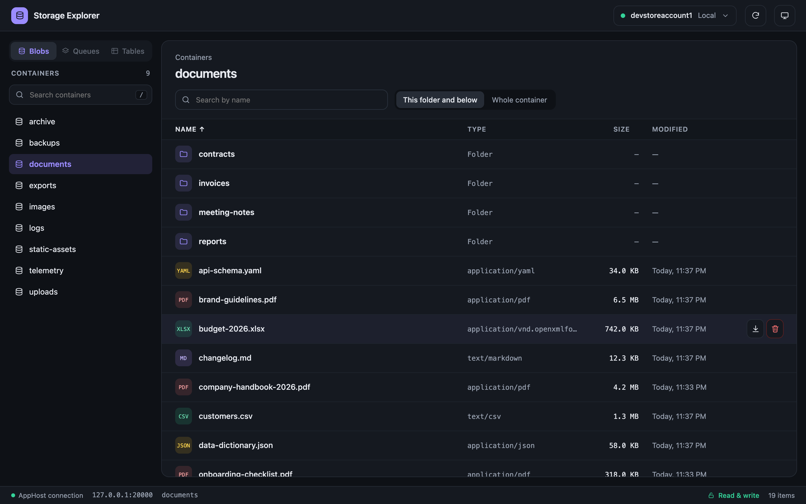
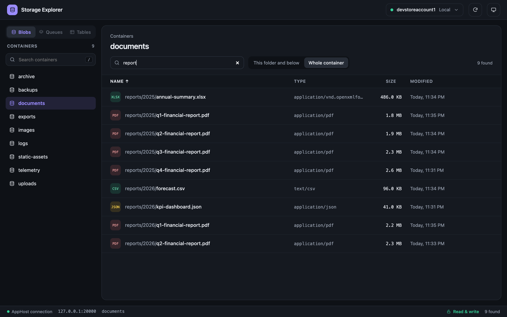
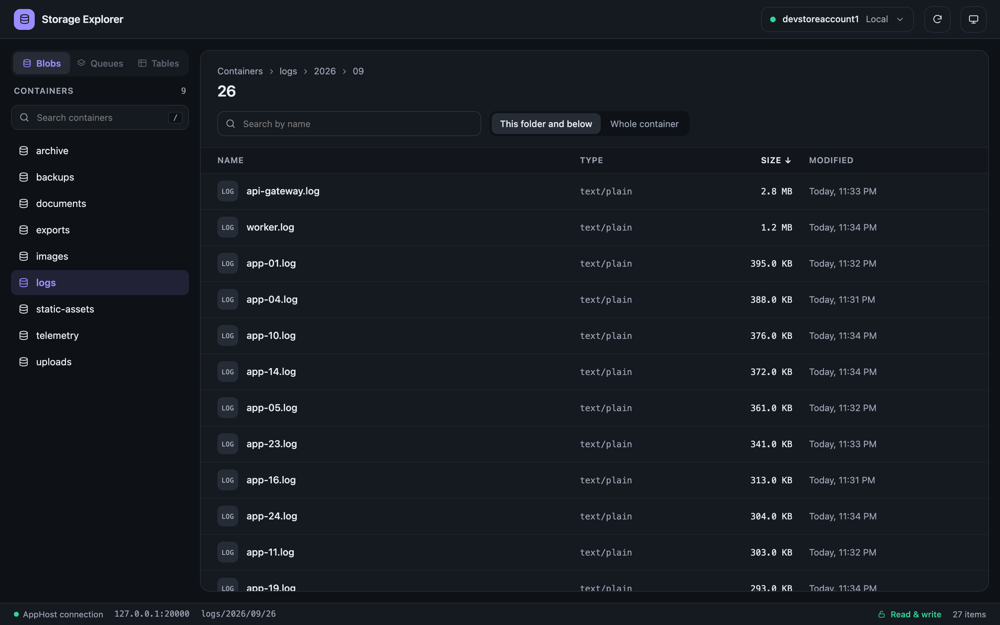
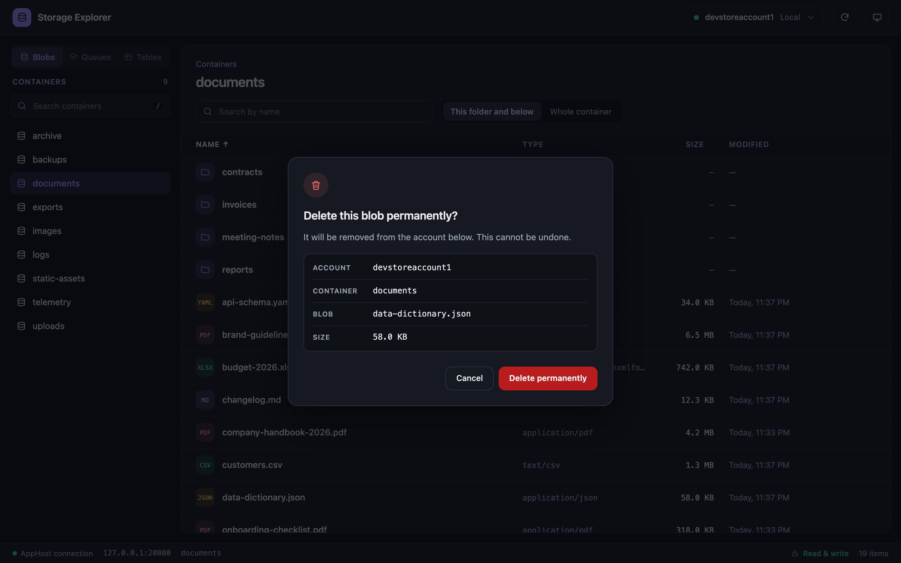
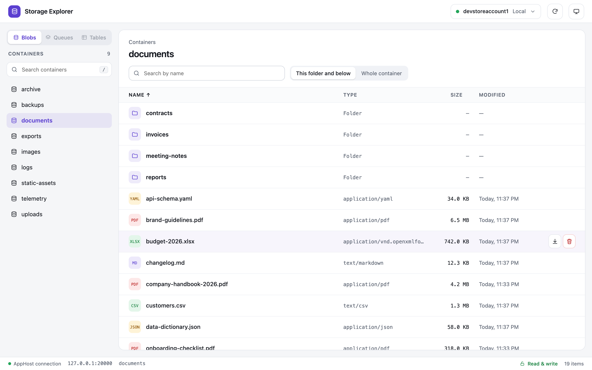
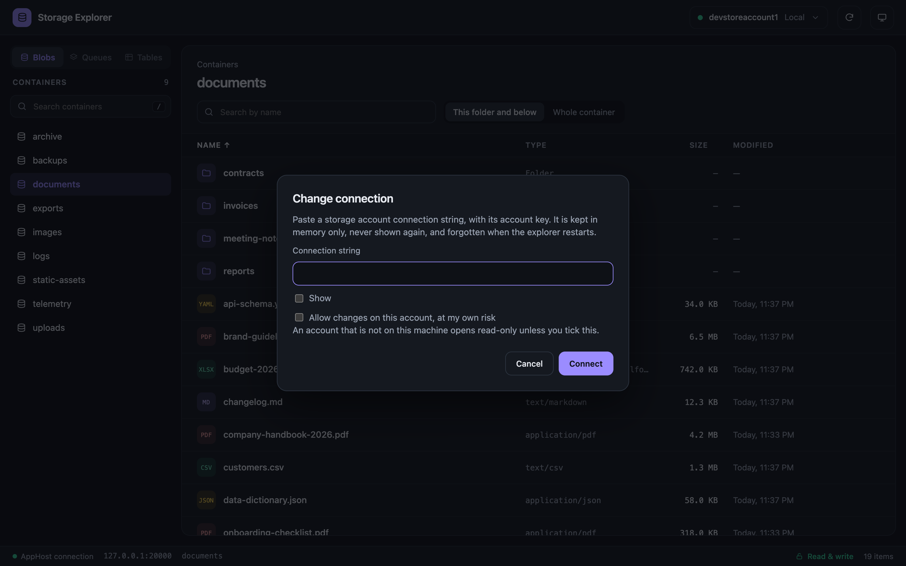

# Storage Explorer

A small web UI, added by this [Aspire](https://aspire.dev) hosting integration, to browse an Azure Storage
account — blobs, queues and tables — during local development with the Azurite emulator. No separate storage
explorer needed.



**Features:**

- **Blobs** — browse with breadcrumbs, search and sort, preview image/PDF/JSON/text inline, download, upload with
  drag and drop, create containers and folders, delete with a confirmation that names the account.
- **Queues** — list with message count, peek up to 32 messages (Base64-encoded ones are decoded automatically), send
  a message, clear or delete a queue.
- **Tables** — list, query with an OData filter (dynamic columns, paging), add or delete an entity, delete a table.

A **Blobs | Queues | Tables** switch above the list picks which one you're browsing, showing only the services the
connected account has. Deleting and other changes are only enabled for local endpoints unless you say otherwise (see
[Read-only](#read-only)).

**Requirements:** .NET 10, Aspire 13.1+ and Docker (the explorer runs as a container next to the emulator). Keep
every `Aspire.*` package in your AppHost at the same version as `Aspire.AppHost.Sdk` — mixing versions fails at
startup.

## Screenshots

| Search the whole container | Sort by any column |
| --- | --- |
|  |  |

| Confirm before deleting | Light and dark themes |
| --- | --- |
|  |  |

## Usage

Add the package to your AppHost project:

```bash
dotnet add package StorageExplorer.Aspire.Hosting
```

Then add the explorer to the storage resource:

```csharp
var builder = DistributedApplication.CreateBuilder(args);

var storage = builder.AddAzureStorage("storage")
    .RunAsEmulator();

storage.WithStorageExplorer();

builder.Build().Run();
```

This adds a `storage-explorer` resource; open its **Storage Explorer** link from the Aspire dashboard.
`WithStorageExplorer` also takes a `configureContainer` callback (image, endpoint, environment) and a `containerName`.

### Another account

With the emulator the connection string is set for you. To browse another account, pass a full account connection
string from `configureContainer` (it replaces the emulator one), preferably through a secret parameter:

```csharp
var connection = builder.AddParameter("explorer-connection", secret: true);

storage.WithStorageExplorer(c => c.WithEnvironment("StorageExplorer__ConnectionString", connection));
```

Set it with `dotnet user-secrets set "Parameters:explorer-connection" "<connection string>"`.

You can also change the account from the page — click the account name at the top right to open **Change
connection**, even on a running explorer. The connection is checked before switching, and **Use the AppHost
connection** goes back to the default.



Local hosts (`localhost`, `127.0.0.1`, `[::1]`, `UseDevelopmentStorage=true`) and another AppHost container's
`<name>.dev.internal` are rewritten automatically so the connection reaches it from inside the explorer's container —
paste a local Azurite or Storage Explorer connection string as-is. Needs Docker Desktop (on Linux Docker Engine, add
`--add-host=host.docker.internal:host-gateway`). Real Azure connection strings are left untouched.

### Read-only

Deleting is on for the emulator and any other local endpoint (`localhost`, `127.0.0.1`, `[::1]`,
`host.docker.internal`, or a container name), and off for any other account, so pasting a real account's connection
string can't delete anything by accident. Download and browsing always work.

```csharp
storage.WithStorageExplorer(readOnly: true);   // never deletes, on any account
storage.WithStorageExplorer(readOnly: false);  // the AppHost connection can delete even when it is not local
```

| `readOnly` | Connection from the AppHost | Connection typed in the page |
| --- | --- | --- |
| `true` | read-only | read-only, and the page cannot lift it |
| not set | local: can delete. Remote: read-only | local: can delete. Remote: read-only, unless you tick **Allow changes on this account, at my own risk** |
| `false` | can delete | same as not set |

The status bar shows **Read-only** or **Writable · own risk** (red banner), and Delete is hidden when read-only — the
server enforces it too (`403` regardless of the page). Allowing changes is per connection, not saved: asked again
every time, lost on restart. A host not recognized as local counts as remote.

## Try the sample

```bash
dotnet run --project samples/Sample.AppHost
```

The sample starts Azurite, seeds a few containers with nested folders, queues with messages and tables with entities,
and adds the explorer. To skip the seeding, set `Seed:Enabled` to `false`:

```bash
dotnet run --project samples/Sample.AppHost -- --Seed:Enabled=false
```

The explorer image is pulled from GitHub Container Registry. To try local changes to the web app instead, build the
image first; it gets the same tag the extension uses, so the sample runs it:

```bash
./scripts/build-image.sh
```

## Security

- `WithStorageExplorer` does nothing when published, so it is never deployed.
- Only `localhost`/`127.0.0.1`/`[::1]` requests are accepted (`AllowedHosts`, overridable); no CORS.
- Deleting or changing the connection needs a custom `X-Storage-Explorer` header plus a same-origin `Origin`, so other
  websites can't trigger it through your browser.
- Remote accounts are read-only by default; `readOnly: true` turns deleting off for good (see [Read-only](#read-only)).
- A connection set from the page lives in memory only — lost on restart, never sent back to the browser, not logged.
  The page shows the account name and endpoint, never the key.

## Limitations

- No file shares.
- Peeking a queue reads up to 32 messages at a time; querying a table reads up to 100 entities a page, with
  **Load more** for the rest.
- Queue messages can only be deleted as the whole peeked batch (**Delete peeked messages**) or the whole queue
  (**Clear queue**), not one message by id — peeking never returns the pop receipt a single-message delete needs.
- Entities can be queried, added and deleted, but not edited yet.
- Each blob folder listing is capped at 5,000 entries.
- Azure can only filter blobs by prefix, so a search reads the listing and filters it client-side: it stops after
  50,000 blobs or 5,000 matches, and the page tells you when it did.
- Keep the storage resource on `RunAsEmulator()`. Without it Aspire provisions real Azure resources and the explorer
  waits for them.
- Only account connection strings with a key work; Entra ID is not supported yet.
- Containers can be created but not deleted.

## Repository layout

| Path | Description |
| --- | --- |
| `src/StorageExplorer.Web` | ASP.NET Core minimal API plus a static page (no build step), and the `Dockerfile` |
| `src/StorageExplorer.Aspire.Hosting` | The Aspire extension, packed as the NuGet package `StorageExplorer.Aspire.Hosting` |
| `samples/Sample.AppHost` | Aspire app that uses the extension |
| `samples/Sample.Seeder` | Fills the emulator with sample blobs, queues and tables |
| `tests/StorageExplorer.Tests` | Unit tests, and tests of the web app with the storage replaced. No Docker needed |
| `tests/StorageExplorer.IntegrationTests` | The web app against a real Azurite that Aspire starts. Needs Docker |
| `tests/StorageExplorer.TestAppHost` | The Aspire app the integration tests start: only Azurite |

Run the tests with:

```sh
dotnet test tests/StorageExplorer.Tests
dotnet test tests/StorageExplorer.IntegrationTests   # needs Docker
```

## License

[MIT](LICENSE)
